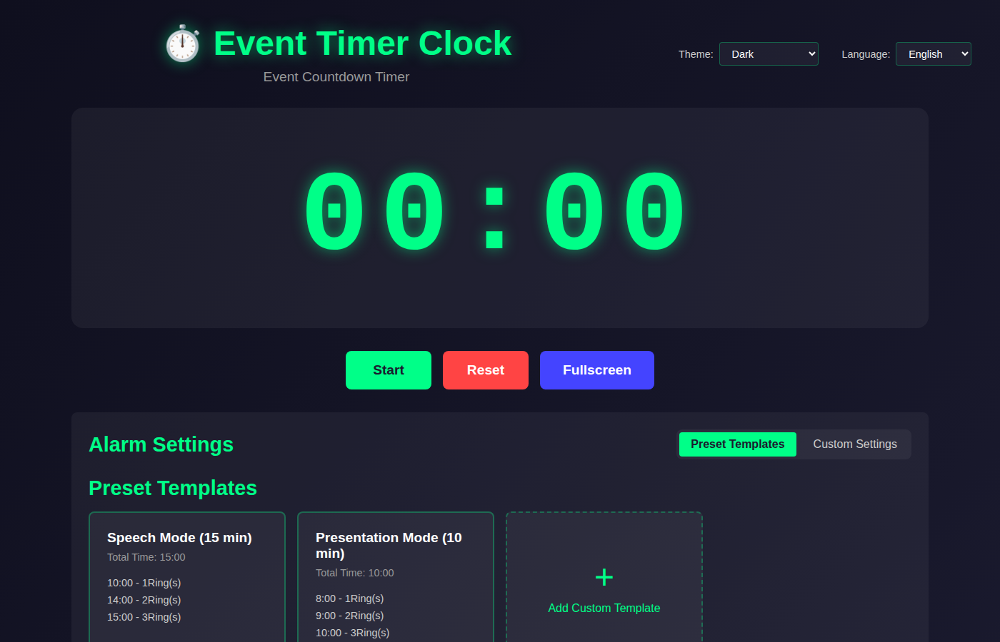
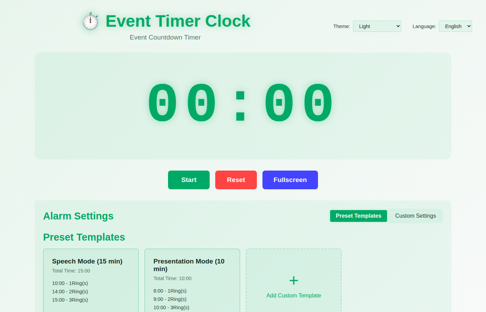

# Event Timer Clock ⏱️

[](https://github.com/lettucebo/EventTimerClock/actions/workflows/ci.yml)
[](https://github.com/lettucebo/EventTimerClock/actions/workflows/deploy.yml)

> English | [繁體中文](README.zh-TW.md)

A stopwatch-style event timer application built with Vue 3, Vite, and TypeScript. Perfect for presentations, speeches, and events with customizable time-based alarms.

### Dark Mode


### Light Mode


## ✨ Features

### 📊 Stopwatch Timer
- Forward counting from 00:00:00
- Large display suitable for projection
- Format: `HH:MM:SS` or `MM:SS`
- Real-time updates using requestAnimationFrame

### 🎮 Control Functions
- **Start** - Begin timing
- **Pause** - Pause timing
- **Reset** - Reset timer to zero
- **Fullscreen** - Toggle fullscreen mode

### 🔔 Time-based Alarms
- Set multiple alarm points
- Configure 1-5 beeps per alarm
- Web Audio API sound implementation
- Visual flash effects on alarm trigger

### 📋 Preset Templates
Built-in templates:
- **Speech Mode (15 minutes)**
  - 10:00 - 1 beep (5 min remaining)
  - 14:00 - 2 beeps (1 min remaining)
  - 15:00 - 3 beeps (time's up)
- **Presentation Mode (10 minutes)**
  - 8:00 - 1 beep
  - 9:00 - 2 beeps
  - 10:00 - 3 beeps

### 🛠️ Custom Settings
- Add/edit/delete time points
- Set beep count for each point
- Save custom templates to localStorage
- Persistent across sessions

### 🔐 Authentication (Optional)
- Sign in with Google account
- Sign in with Microsoft account
- Secure OAuth 2.0 authentication via Firebase
- User profile display with avatar
- See [OAuth Setup Guide](docs/OAUTH_SETUP.md) for configuration

### 🎨 Interface Design
- Responsive design (mobile & desktop)
- Dark mode optimized for projection
- Clean and intuitive UI
- Fullscreen support

## 🚀 Quick Start

### Prerequisites
- Node.js 18+ 
- npm or yarn

### Deployment

This project uses GitHub Actions for automatic deployment to GitHub Pages. The deployment workflow is triggered **only when a commit is tagged**.

#### How to Deploy

1. **Tag a commit** to trigger deployment:
   ```bash
   # Create and push a tag
   git tag v1.0.0
   git push origin v1.0.0
   
   # Or create a lightweight tag with any name
   git tag release-YYYY-MM-DD
   git push origin release-YYYY-MM-DD
   ```

2. **Manual deployment** via GitHub Actions UI:
   - Go to Actions tab → Deploy to GitHub Pages workflow
   - Click "Run workflow" button
   - Select branch and run

3. **View deployment status**:
   - Check the [Deploy workflow](https://github.com/lettucebo/EventTimerClock/actions/workflows/deploy.yml) badge
   - Visit GitHub Pages URL after successful deployment

#### Custom Domain Configuration

This project is configured to work with a custom domain (`timer.yu.money`). The `public/CNAME` file ensures the custom domain setting persists after each deployment. If you want to use a different custom domain:

1. Update the `public/CNAME` file with your domain name
2. Configure your DNS provider to point to GitHub Pages
3. Enable custom domain in your repository's GitHub Pages settings

> 📝 **Note**: Regular commits without tags will **not** trigger deployment. This ensures only releases are deployed to production.

### Installation

```bash
# Clone the repository
git clone https://github.com/lettucebo/EventTimerClock.git
cd EventTimerClock

# Install dependencies
npm install

# Start development server
npm run dev
```

Visit `http://localhost:5173/` in your browser.

### Build for Production

```bash
# Build the application
npm run build

# Preview production build
npm run preview
```

## 📖 Usage Guide

### Using Preset Templates
1. Select a preset template from the "Preset Templates" section
2. Click on a template card to load its time points
3. Click "Start" to start the timer

### Creating Custom Alarms
1. Switch to "Custom Settings" mode
2. Enter time in minutes and seconds
3. Set the number of beeps (1-5)
4. Click "Add" to add the time point
5. Add a template name and click "Save as Template" to save

### Controlling the Timer
- **Start**: Begin timing from current position
- **Pause**: Pause the timer
- **Reset**: Reset to 00:00 and clear all triggered alarms
- **Fullscreen**: Toggle fullscreen mode

## 🎨 Favicon

The application includes a custom favicon that matches the timer/stopwatch theme:

### Files and Sizes
| File | Size | Purpose |
|------|------|---------|
| `favicon.svg` | Scalable | Modern browsers, best quality |
| `favicon.ico` | 16x16, 32x32, 48x48 | Legacy browser support |
| `favicon-16x16.png` | 16×16 | Standard favicon |
| `favicon-32x32.png` | 32×32 | Retina displays |
| `favicon-48x48.png` | 48×48 | Windows taskbar |
| `apple-touch-icon.png` | 180×180 | iOS home screen |
| `favicon-192x192.png` | 192×192 | Android Chrome |
| `favicon-512x512.png` | 512×512 | PWA splash screen |
| `site.webmanifest` | - | PWA manifest |

### Location
All favicon files are located in the `public/` directory and are automatically served at the root URL by Vite.

## 🏗️ Project Structure

```
src/
├── components/
│   ├── StopwatchDisplay.vue    # Time display component
│   ├── ControlButtons.vue      # Control buttons
│   ├── AlarmSettings.vue       # Alarm settings container
│   ├── PresetTemplates.vue     # Preset template selector
│   └── TimePointEditor.vue     # Time point editor
├── composables/
│   ├── useStopwatch.ts         # Stopwatch logic
│   ├── useAlarm.ts             # Alarm logic
│   └── useStorage.ts           # localStorage logic
├── types/
│   └── index.ts                # TypeScript type definitions
├── utils/
│   └── audio.ts                # Web Audio API utilities
├── App.vue                     # Main application
├── main.ts                     # Application entry
└── style.css                   # Global styles
```

## 🛠️ Technology Stack

- **Framework**: Vue 3 (Composition API + `<script setup>`)
- **Build Tool**: Vite
- **Language**: TypeScript
- **Styling**: CSS (with CSS Variables)
- **State Management**: Vue reactive/ref
- **Audio**: Web Audio API

## 📝 Type Definitions

```typescript
interface TimePoint {
  id: string;
  timeInSeconds: number;  // Trigger time in seconds
  ringCount: number;      // Number of beeps (1-5)
  triggered: boolean;     // Whether triggered
}

interface Preset {
  id: string;
  name: string;
  totalTime: number;      // Total time in seconds
  timePoints: TimePoint[];
}

interface StopwatchState {
  isRunning: boolean;
  elapsedTime: number;    // Elapsed time in milliseconds
  currentPreset: Preset | null;
}
```

## ✅ Acceptance Criteria

- ✅ Project starts with `npm install` and `npm run dev`
- ✅ Stopwatch can start, pause, resume, and reset
- ✅ Alarms trigger at specified times
- ✅ Correct number of beeps per alarm
- ✅ Preset templates and custom mode available
- ✅ Settings persist to localStorage
- ✅ Responsive on mobile and desktop
- ✅ Fullscreen mode supported

## 🤝 Contributing

Contributions are welcome! Please feel free to submit a Pull Request.

## 📄 License

This project is open source and available under the MIT License.

## 👤 Author

Created with ❤️ for event organizers and speakers everywhere.
