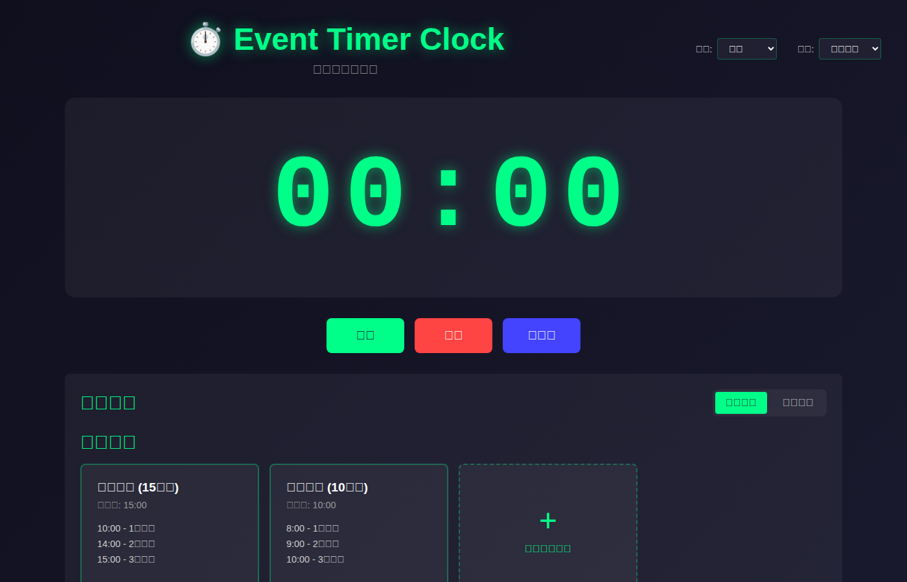
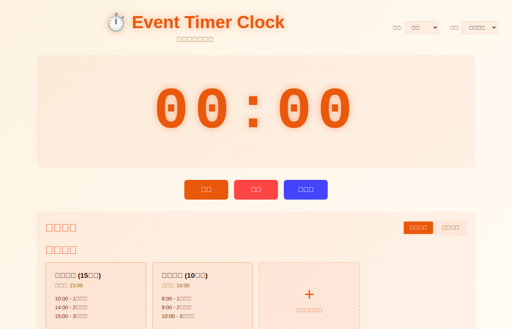

# Event Timer Clock ⏱️

[](https://github.com/lettucebo/EventTimerClock/actions/workflows/ci.yml)
[](https://github.com/lettucebo/EventTimerClock/actions/workflows/deploy.yml)

> [English](README.en.md) | 繁體中文

一款使用 Vue 3、Vite 和 TypeScript 建立的碼錶式活動計時器應用程式。非常適合簡報、演講和活動使用，並具有可自訂的時間響鈴功能。

### 暗色模式


### 亮色模式


## ✨ 功能特色

### 📊 碼錶計時器
- 從 00:00:00 開始正向計時
- 大型顯示適合投影
- 格式：`HH:MM:SS` 或 `MM:SS`
- 使用 requestAnimationFrame 實現即時更新

### 🎮 控制功能
- **開始** - 開始計時
- **暫停** - 暫停計時
- **重置** - 重置計時器為零
- **全螢幕** - 切換全螢幕模式

### 🔔 時間響鈴
- 設定多個響鈴時間點
- 每個響鈴可設定 1-5 次響鈴
- Web Audio API 聲音實現
- 響鈴觸發時的視覺閃爍效果

### 📋 預設模板
內建模板：
- **演講模式 (15分鐘)**
  - 10:00 - 1次響鈴 (剩餘5分鐘)
  - 14:00 - 2次響鈴 (剩餘1分鐘)
  - 15:00 - 3次響鈴 (時間到)
- **簡報模式 (10分鐘)**
  - 8:00 - 1次響鈴
  - 9:00 - 2次響鈴
  - 10:00 - 3次響鈴

### 🛠️ 自訂設定
- 新增/編輯/刪除時間點
- 設定每個時間點的響鈴次數
- 將自訂模板儲存到 localStorage
- 跨工作階段持久化

### 🎨 介面設計
- 響應式設計 (行動裝置和桌面)
- 深色模式最適合投影
- 簡潔直觀的使用者介面
- 全螢幕支援

## 🚀 快速開始

### 前置需求
- Node.js 18+ 
- npm 或 yarn

### 部署

此專案使用 GitHub Actions 自動部署到 GitHub Pages。部署工作流程**僅在提交標籤時觸發**。

#### 如何部署

1. **標記提交**以觸發部署：
   ```bash
   # 建立並推送標籤
   git tag v1.0.0
   git push origin v1.0.0
   
   # 或使用任何名稱建立輕量級標籤
   git tag release-YYYY-MM-DD
   git push origin release-YYYY-MM-DD
   ```

2. **手動部署**透過 GitHub Actions UI：
   - 前往 Actions 標籤 → Deploy to GitHub Pages 工作流程
   - 點擊 "Run workflow" 按鈕
   - 選擇分支並執行

3. **檢視部署狀態**：
   - 查看 [Deploy workflow](https://github.com/lettucebo/EventTimerClock/actions/workflows/deploy.yml) 徽章
   - 部署成功後造訪 GitHub Pages URL

#### 自訂網域設定

此專案已設定為使用自訂網域（`timer.yu.money`）。`public/CNAME` 檔案確保自訂網域設定在每次部署後都能保留。如果您想使用不同的自訂網域：

1. 更新 `public/CNAME` 檔案為您的網域名稱
2. 設定您的 DNS 供應商指向 GitHub Pages
3. 在儲存庫的 GitHub Pages 設定中啟用自訂網域

> 📝 **注意**：沒有標籤的一般提交**不會**觸發部署。這確保只有發布版本會部署到正式環境。

### 安裝

```bash
# 複製儲存庫
git clone https://github.com/lettucebo/EventTimerClock.git
cd EventTimerClock

# 安裝相依套件
npm install

# 啟動開發伺服器
npm run dev
```

在瀏覽器中造訪 `http://localhost:5173/`。

### 建置正式版本

```bash
# 建置應用程式
npm run build

# 預覽正式版本建置
npm run preview
```

## 📖 使用指南

### 使用預設模板
1. 從「預設模板」區域選擇預設模板
2. 點擊模板卡片以載入其時間點
3. 點擊「開始」啟動計時器

### 建立自訂響鈴
1. 切換到「自訂設定」模式
2. 輸入分鐘和秒數
3. 設定響鈴次數 (1-5)
4. 點擊「新增」來新增時間點
5. 新增模板名稱並點擊「儲存為模板」來儲存

### 控制計時器
- **開始**：從目前位置開始計時
- **暫停**：暫停計時器
- **重置**：重置為 00:00 並清除所有已觸發的響鈴
- **全螢幕**：切換全螢幕模式

## 🎨 Favicon

應用程式包含符合計時器/碼錶主題的自訂 favicon：

### 檔案與尺寸
| 檔案 | 尺寸 | 用途 |
|------|------|------|
| `favicon.svg` | 可縮放 | 現代瀏覽器，最佳品質 |
| `favicon.ico` | 16x16, 32x32, 48x48 | 舊版瀏覽器支援 |
| `favicon-16x16.png` | 16×16 | 標準 favicon |
| `favicon-32x32.png` | 32×32 | Retina 顯示器 |
| `favicon-48x48.png` | 48×48 | Windows 工作列 |
| `apple-touch-icon.png` | 180×180 | iOS 主畫面 |
| `favicon-192x192.png` | 192×192 | Android Chrome |
| `favicon-512x512.png` | 512×512 | PWA 啟動畫面 |
| `site.webmanifest` | - | PWA 清單 |

### 位置
所有 favicon 檔案位於 `public/` 目錄中，由 Vite 自動在根 URL 提供服務。

## 🏗️ 專案結構

```
src/
├── components/
│   ├── StopwatchDisplay.vue    # 時間顯示元件
│   ├── ControlButtons.vue      # 控制按鈕
│   ├── AlarmSettings.vue       # 響鈴設定容器
│   ├── PresetTemplates.vue     # 預設模板選擇器
│   └── TimePointEditor.vue     # 時間點編輯器
├── composables/
│   ├── useStopwatch.ts         # 碼錶邏輯
│   ├── useAlarm.ts             # 響鈴邏輯
│   └── useStorage.ts           # localStorage 邏輯
├── types/
│   └── index.ts                # TypeScript 類型定義
├── utils/
│   └── audio.ts                # Web Audio API 工具
├── App.vue                     # 主應用程式
├── main.ts                     # 應用程式進入點
└── style.css                   # 全域樣式
```

## 🛠️ 技術堆疊

- **框架**：Vue 3 (Composition API + `<script setup>`)
- **建置工具**：Vite
- **語言**：TypeScript
- **樣式**：CSS (使用 CSS Variables)
- **狀態管理**：Vue reactive/ref
- **音訊**：Web Audio API

## 📝 類型定義

```typescript
interface TimePoint {
  id: string;
  timeInSeconds: number;  // 觸發時間（秒）
  ringCount: number;      // 響鈴次數 (1-5)
  triggered: boolean;     // 是否已觸發
}

interface Preset {
  id: string;
  name: string;
  totalTime: number;      // 總時間（秒）
  timePoints: TimePoint[];
}

interface StopwatchState {
  isRunning: boolean;
  elapsedTime: number;    // 經過時間（毫秒）
  currentPreset: Preset | null;
}
```

## ✅ 驗收標準

- ✅ 專案可透過 `npm install` 和 `npm run dev` 啟動
- ✅ 碼錶可以開始、暫停、繼續和重置
- ✅ 響鈴在指定時間觸發
- ✅ 每個響鈴的正確次數
- ✅ 提供預設模板和自訂模式
- ✅ 設定持久化到 localStorage
- ✅ 在行動裝置和桌面上響應
- ✅ 支援全螢幕模式

## 🤝 貢獻

歡迎貢獻！請隨時提交 Pull Request。

## 📄 授權

此專案是開源的，使用 MIT 授權。

## 👤 作者

為世界各地的活動組織者和演講者用心打造 ❤️
